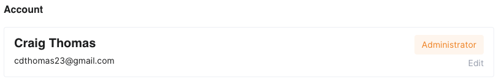
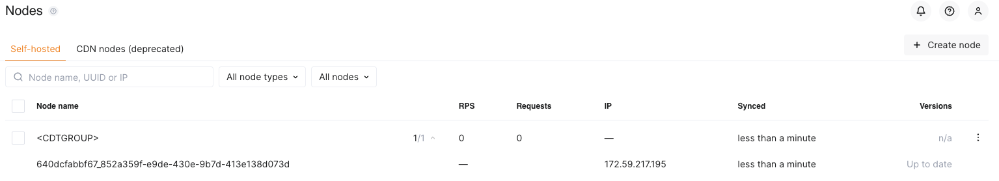
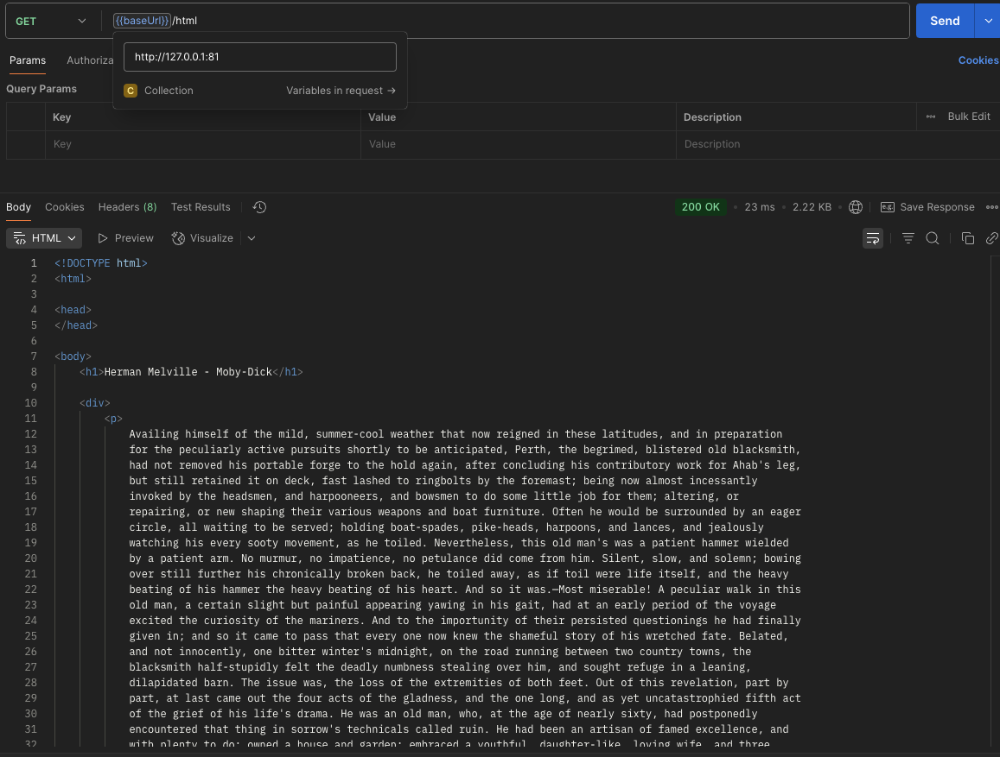
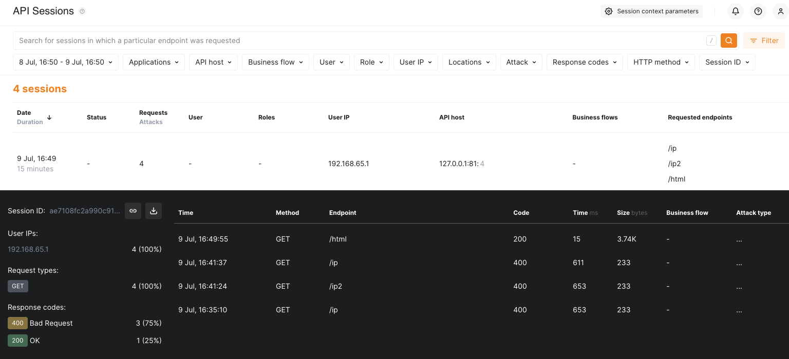
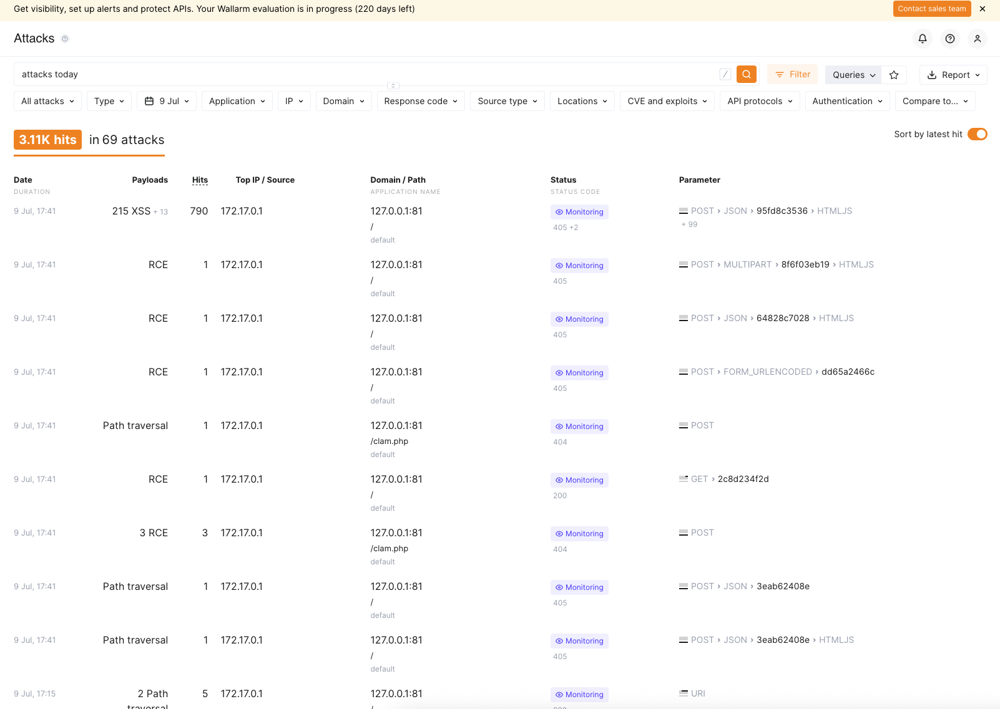

# Wallarm Solutions Engineer Technical Evaluation

## 📌 Overview

Welcome to the **Wallarm Solutions Engineer Technical Evaluation**. This exercise is designed to assess your ability to deploy and configure Wallarm's filtering nodes using a deployment method of your choice, troubleshoot any issues encountered, and document your process effectively. Additionally, we will evaluate your ability to leverage our official documentation to complete the task.

---

## 📂 Prerequisites
**Desktop Environment**
- I will be using Docker running on my local Mac (Mac silicon, so ARM64 architecture) for the various components of this deployment including (as detailed in the drawing)
**Backend Application/API endpoint**
- I used Postman to connect to and test the HTTPBin container (also tested it against https://httpbin.org)
 - For the local container, I just ran it using `docker run -p 80:80 kennethreitz/httpbin`
 -  I was able to import the collection from Postman for quicker access to the various parts of the API (https://www.postman.com/postman/httpbin/documentation/0bjofuo/httpbin-org-current)
 - I set the `baseURL` variable to `https://httpbin.org` for testing on the web and `http://127.0.0.1` for testing my local API container
  - For testing against `https://httpbin.org`, I successfully got my external IP address
  - For testing against `http://172.0.0.1`, I successfully the IP of my Mac on the Docker Bridge network (in this case `172.17.0.1`)
 - For a simple test, I tested `GET` against `/ip`
 *** INCLUDE SCREENSHOTS ***
 - I also looked at using mockapi.io, but httpbin works well, since the API is fully set up. mockapi.io is nice when building out a quick mock API
**GoTestWAF**
- I spun this up in a Docker container running in my desktop environment
**Documentation**
- I referenced this for the various deployments and throughout the process
**Wallarm GUI/Account**
- I got the invite from Brandon, and set up my account in the Wallarm tenant: https://us1.my.wallarm.com/ and user account: `cdthomas23@gmail.com`

## 🚀 Task Breakdown
### 1️⃣ Deploy a Wallarm Filtering Node
### 2️⃣ Set Up a Backend Origin
- I am using the Docker NGINX-based Image (https://docs.wallarm.com/admin-en/installation-docker-en/)
- Requirements:
 ✅  Docker installed on your host system
 ✅  Access to https://hub.docker.com/r/wallarm/node to download the Docker image. Please ensure the access is not blocked by a firewall
  - Verified I could do a `docker pull wallarm/node`
 ✅  Access to the account with the Administrator role in Wallarm Console in the US Cloud or EU Cloud
  - cdthomas23@gmail.com has the Adminstrator role
  - 
 ✅ Access to https://us1.api.wallarm.com if working with US Wallarm Cloud or to https://api.wallarm.com if working with EU Wallarm Cloud. Please ensure the access is not blocked by a firewall
 ✅ Access to the IP addresses below for downloading updates to attack detection rules and API specifications, as well as retrieving precise IPs for your allowlisted, denylisted, or graylisted countries, regions, or data centers:
 ```
 34.96.64.17
 34.110.183.149
 35.235.66.155
 34.102.90.100
 34.94.156.115
 35.235.115.105
 ```
1. Set up API Token (Settings->API Tokens)
   - Created new token named `DeploymentToken1`
   - Token Usage: `Node Deployment`
   - No expiration
   - Source role: `Deploy`
   - I then pasted this in my Password Manager for later use
2. Start back up the API (running on port 80 and expose port 80)
3. Initally run the Wallarm container (running on port 80, but exposed on port 81)
   - Using `6.3.0`, which is the version corresponding to latest on 20250709 @ 1600 ET
   - `docker run -d -e WALLARM_API_TOKEN='XXXXXXX' -e WALLARM_LABELS='group=<CDTGROUP>' -e NGINX_BACKEND='127.0.0.1' -e WALLARM_API_HOST='us1.api.wallarm.com' -p 81:80 wallarm/node:6.3.0`
4. Node deployed to Wallarm succesfully (using Docker Run and basic ENV vars versus the config file, which I will look at later):
   - 
5. Tested using curl, and saw those items in the console
6. Tested via Postman, I see the sessions in the Wallarm console, but it was not successfully proxying the connection through
   - After some testing, realized I needed to use the *internal* IP of the httpbin server
   - Found the IP of both of the containers using `docker inspect | grep IPAddress`
     - `httpbin`: "IPAddress": "172.17.0.2",
     - `Wallarm Node`: "IPAddress": "172.17.0.3"
7. So, I redeployed the Wallarm Node container, using the internal (172.17.0.2) address for the API
    - - `docker run -d -e WALLARM_API_TOKEN='XXXXXXX' -e WALLARM_LABELS='group=<CDTGROUP>' -e NGINX_BACKEND='172.17.0.2' -e WALLARM_API_HOST='us1.api.wallarm.com' -p 81:80 wallarm/node:6.3.0`
8. Tested in Postman, and I got the result, and I see the session in Wallarm under `API Sessions`
    - 
    - 

***Filtering Node and API backend running succesfully!***

### 3️⃣ Generate Traffic Using GoTestWAF
1. Using documentation here: https://github.com/wallarm/gotestwaf
2. I am using the Docker container for GoTestWAF
    - As of 20250709 @ 1700 ET, `latest` = `0.5.6`, so I will specify and use that
3. Ran the GoTestWAF tool, using this command:
    `docker run --rm --network="host" -it -v ${PWD}/reports:/app/reports wallarm/gotestwaf:0.5.6 --url="http://127.0.0.1:81" --noEmailReport`
    - Kept throwing error: `error="WAF was not detected. Please use the '--blockStatusCodes' or '--blockRegex' flags. Use '--help' for additional info. Baseline attack status code: 200"`
    - Reached out to Brandon, but in the meantime, I found several more options in the documentation
    - Added the `--skipWAFBlockCheck` flag, and the tool ran
4. Reports were generated, and these are added to my local directory, since I mapped the volume in the `docker run` command
5. I opened up the reports, and they look complete
6. I also looked at the attacks in the Wallarm console, and they have increased significantly4
    - 


----------


## 🎯 Objectives

By the end of this evaluation, you should be able to:

✅ Deploy a Wallarm filtering node using a supported method of your choice.  
✅ Configure a backend origin to receive test traffic. (httpbin.org is also acceptable)  
✅ Use the **GoTestWAF** attack simulation tool to generate traffic.  

✅ Document the deployment and troubleshooting process.  
✅ Demonstrate proficiency in using **Wallarm's official documentation**.  

---


---

## 🚀 Task Breakdown

### 1️⃣ Deploy a Wallarm Filtering Node

🔹 Choose a [deployment method](https://docs.wallarm.com/installation/supported-deployment-options/) (**e.g., Docker, Kubernetes, AWS, etc.**).  
🔹 Follow the [**official Wallarm documentation**](https://docs.wallarm.com/) to install and configure the filtering node.  
🔹 Verify that the filtering node is properly deployed and running.  

### 2️⃣ Set Up a Backend Origin

🔹 Configure a simple **backend API or web application** to receive traffic.  
🔹 Ensure the backend is **reachable from the filtering node**.  

### 3️⃣ Generate Traffic Using GoTestWAF

🔹 Install and configure **GoTestWAF**.  
🔹 Send attack simulation traffic through the **Wallarm filtering node**.  
🔹 Analyze the results and confirm that attacks are being detected.  

### 4️⃣ Document Your Process

📝 Provide an **overview summary** of your deployment and why you chose it.  
🛠️ Document any **issues encountered and how you resolved them**.  
📸 Include **relevant logs, screenshots, or outputs** where applicable.  

---

## ✅ Evaluation Criteria

Your submission will be evaluated based on:

📌 **Completeness**: Were all required tasks completed?  
📌 **Clarity**: Is the documentation clear and well-structured?  
📌 **Troubleshooting**: How well did you document and resolve any issues?  
📌 **Understanding of the Product**: Did you correctly set up and use the Wallarm filtering node?  
📌 **Use of Official Documentation**: Did you successfully leverage Wallarm's official resources?  

---

## 📬 Submission

Once you have completed the evaluation, submit the following:

📂 Fork this **GitHub repo** and use it as the repository for your documentation, configuration files, and any relevant logs or screenshots.  
📜 A **README file** summarizing your process and key findings.  
📜 A **HIGH Level Diargram** that illustrates what you built and how traffic is flowing.  

---

## ℹ️ Additional Notes

💡 You are encouraged to **ask questions and leverage Wallarm's documentation**.  
📖 The ability to **document your troubleshooting steps** is just as important as the final deployment.  

🚀 **Good luck, and we look forward to your submission!** 🎉
